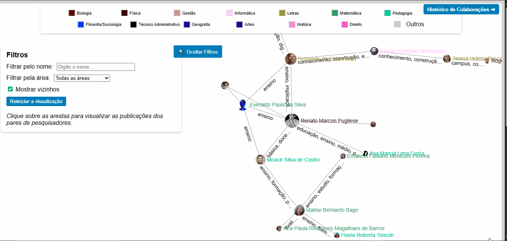
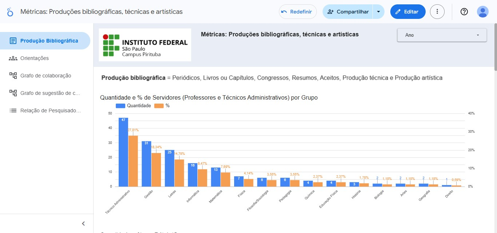
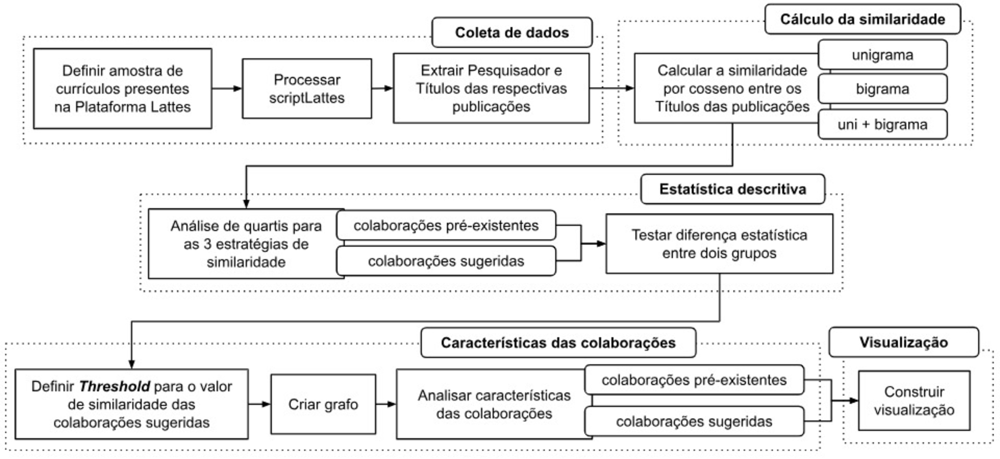
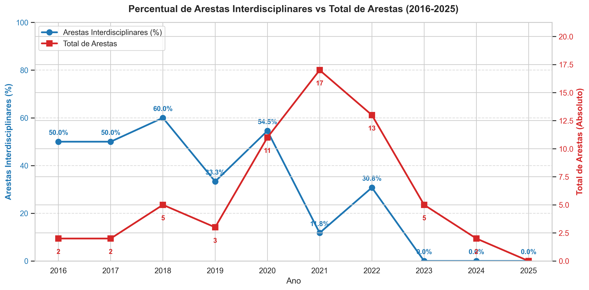
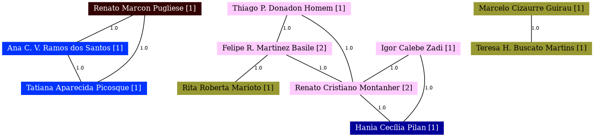

---

# 🌐 Análise de Colaboração Acadêmica - IFSP Pirituba

Projeto de Data Science que utiliza **Processamento de Linguagem Natural (NLP), Análise de Redes Sociais (SNA) e Estatística Descritiva** para mapear, analisar e sugerir colaborações acadêmicas entre servidores (docentes e técnicos administrativos) dentro de uma instituição de ensino superior (IFSP — Câmpus Pirituba). O projeto culminou no desenvolvimento de um sistema de recomendação de novas parcerias, fornecendo métricas topológicas para apoiar a tomada de decisão e a gestão estratégica institucional.

*Projeto de Iniciação Científica desenvolvido no IFSP — Câmpus Pirituba.*
* **Pesquisador:** Leonardo Vargas Baffa
* **Orientação:** Prof. Dr. Fabio Teixeira

---

## 🌐 Visualização Interativa de Grafos (Demo)

O projeto inclui uma aplicação web interativa desenvolvida com `Sigma.js` para exploração espacial das redes de colaboração. A interface permite a navegação visual pelas redes de pesquisa, identificação de comunidades científicas, inspeção de colaborações reais e explicação transparente das recomendações do modelo NLP (*Explainable AI*).

 

Experimente a aplicação rodando em produção diretamente no seu navegador:

🔗 **[Acessar Aplicação](https://lbaffa.github.io/analise-colaboracao-academica-ifsp/)** 

---

## 📊 Dashboard Executivo (Business Intelligence)

Para democratizar o acesso aos *insights* gerados pelas métricas de produtividade e topologia, os dados foram produtizados em um dashboard interativo no Looker Studio, permitindo exploração via *Cross-Filtering*.

🔗 **[Acessar Dashboard Executivo — Looker Studio](https://lookerstudio.google.com/s/q6lpVn7Dpow)**



---

## 🎯 Destaques Analíticos

- **Engenharia de Dados (ETL):** construção de pipelines reprodutíveis para extração, limpeza e estruturação de dados acadêmicos provenientes da Plataforma Lattes.

- **Validação Estatística de Modelos:** o sistema de recomendação foi validado comparando a similaridade semântica sugerida pelo algoritmo com colaborações reais históricas utilizando **tamanho de efeito (d de Cohen)**.

- **Modelagem orientada a BI:** adaptação das bases analíticas para consumo eficiente em dashboards executivos e exploração interativa.

---

## 🏗️ Arquitetura do Pipeline

O projeto exigiu a construção de um pipeline de dados completo devido à ausência de conjuntos de dados institucionais centralizados.

O pipeline analítico foi estruturado em etapas sequenciais:

- **Extração de dados:** scraping automatizado da Plataforma Lattes utilizando o `scriptLattes`
- **Pipeline ETL:** transformação de saídas HTML em conjuntos de dados estruturados usando Python e Pandas
- **Modelagem de NLP:** similaridade semântica entre pesquisadores usando `CountVectorizer` e `Similaridade de Cosseno`
- **Validação estatística:** teste de tamanho de efeito (d de Cohen) comparando colaborações sugeridas vs. reais
- **Análise de grafos:** redes de colaboração modeladas com `NetworkX`
- **Implementação (Deployment):** visualização interativa de redes usando `Sigma.js` e dashboard construído com Google Looker Studio

---

## 🔬 Fluxo Metodológico da Pesquisa

Fluxograma das etapas analíticas utilizadas no estudo.



*Nota: A implementação em código de cada uma dessas etapas (ETL, NLP, Grafos e Deploy) foi modularizada sob o padrão de Engenharia de Dados e está detalhada na seção [Documentação Técnica](#-documentação-técnica).*
---

## ❓ Questões de Negócio e Pesquisa Respondidas

Este projeto de Ciência de Dados foi desenhado para atuar como uma ferramenta de diagnóstico e planejamento estratégico institucional. Todo o pipeline e a modelagem foram construídos para responder a perguntas como:

**📊 Diagnóstico Histórico e Produtividade**
* Qual é o nível real de integração acadêmica interna do câmpus e como essa dinâmica evoluiu ao longo da última década (2016–2025)?
* A produção científica está distribuída de forma equitativa ou existe concentração em polos específicos?
* Qual foi o impacto de eventos macro (como o distanciamento social na pandemia em 2020-2021) no volume de publicações e orientações acadêmicas institucionais?

**🕸️ Topologia e Comportamento da Rede (SNA)**
* A estrutura de pesquisa do câmpus é descentralizada ou depende de poucos indivíduos altamente conectados (*hubs* de conhecimento)?
* Os pesquisadores costumam colaborar apenas com seus pares com o mesmo nível de conectividade (viés de assortatividade)?
* O grau de colaboração interdisciplinar (entre diferentes áreas de atuação) tem aumentado ou diminuído com o passar dos anos?

**🧠 Inteligência Preditiva e NLP**
* Como podemos ir além das métricas passadas e descobrir "conexões latentes" (pesquisadores com forte afinidade temática, mas que nunca colaboraram)?
* É viável utilizar *Processamento de Linguagem Natural* nos títulos das publicações para prever cientificamente e recomendar novas parcerias estratégicas, fomentando a inovação cruzada na instituição?

## 📊 Principais Resultados Analíticos

A análise das redes de colaboração acadêmica entre servidores do Câmpus revelou padrões estruturais relevantes na dinâmica de pesquisa institucional.

Principais insights identificados:

- **Baixa densidade de colaboração interna:**  
  apenas **23% dos pesquisadores** do campus realizaram algum tipo de colaboração acadêmica interna entre 2016 e 2025.

- **Baixa longevidade das colaborações:**  
  cerca de **80% das colaborações ocorreram apenas em um único ano**, indicando ausência de linhas de pesquisa duradouras entre os pesquisadores.

- **Concentração da produção científica:**  
  aproximadamente **70% das produções bibliográficas** estão concentradas em quatro áreas principais: Gestão, Letras, Matemática e Informática.

- **Pico de produção durante o período pandêmico:**  
  a produção científica e o número de orientações atingiram seu **máximo em 2021**, possivelmente associado ao aumento da colaboração digital durante o período de pandemia.

- **Baixa interdisciplinaridade nas colaborações:**  
  as colaborações entre áreas distintas diminuíram ao longo dos anos e **desapareceram completamente após 2023**.

- **Rede de colaboração com comportamento estrutural neutro:**  
  o coeficiente de assortatividade da rede (DAC ≈ -0.04) indica uma **estrutura próxima de aleatória**, sem tendência clara de agrupamento por grau de conectividade.

- **Identificação de colaborações potenciais via NLP:**  
  o sistema de recomendação baseado em **similaridade semântica de títulos de publicações** identificou pares de pesquisadores com alto potencial de colaboração ainda não explorado.

### 📐 Validação Estatística do Modelo (NLP)

A eficácia do sistema de recomendação (Similaridade de Cosseno) foi validada estatisticamente calculando o **Tamanho de Efeito (d de Cohen)**. 

O objetivo foi comparar a distribuição de similaridade das parcerias sugeridas pelo algoritmo com a distribuição das colaborações que de fato ocorreram historicamente no câmpus, testando diferentes estratégias de NLP e limiares de corte:

| Cenário de NLP | d (Sem Corte) | d (>= Q1) | d (>= Mediana) |
| :--- | :---: | :---: | :---: |
| **Unigrama** | 3.873 | 0.450 | **0.010** |
| **Bigrama** | 3.437 | NaN* | NaN* |
| **Misto (Uni + Bi)** | 5.311 | 0.471 | 0.013 |

> 💡 **Conclusão Analítica:** O cenário **Unigrama** com corte na **Mediana** apresentou o menor tamanho de efeito (*d = 0.010*). Isso prova matematicamente que as novas colaborações recomendadas pelo modelo replicam bem a tendência das colaborações reais já consolidadas na instituição. Ou seja, o algoritmo recomenda parcerias altamente realistas e prontas para execução.
> 
> *(Nota: Os valores `NaN` no cenário de bigramas refletem a alta esparsidade da matriz de termos ao aplicarmos cortes rigorosos).*

Esses resultados demonstram como técnicas de **Análise de Redes Sociais (SNA)** combinadas com **Processamento de Linguagem Natural (NLP)** podem apoiar decisões estratégicas de gestão científica em instituições acadêmicas.


*(Evolução temporal do volume de colaborações absolutas versus o percentual de colaborações interdisciplinares).*

> ⚠️ **Nota sobre os dados de 2025:** A ausência de arestas no ano de 2025 não reflete necessariamente uma queda real de produtividade, mas sim um viés temporal da janela de extração (coleta realizada no 1º trimestre de 2025). Para detalhes sobre o tratamento deste "buraco" sazonal, consulte as [Premissas de Negócio e Vieses da Base](docs/5_limitations_and_bias.md)

---

## 💡 Possíveis Aplicações

A metodologia desenvolvida pode ser aplicada em diferentes contextos institucionais:

- diagnóstico de redes de pesquisa em universidades
- identificação de oportunidades de colaboração científica
- apoio à gestão estratégica de programas de pós-graduação
- análise de ecossistemas de inovação e pesquisa

---

## 🛠️ Stack Tecnológico
- **Linguagem:** Python
- **Manipulação de Dados:** Pandas, NumPy
- **Análise de Redes:** NetworkX, Louvain algorithm
- **NLP:** NLTK, Scikit-learn
- **Visualização:** Matplotlib, Seaborn
- **Deploy / BI:** Sigma.js, Google Looker Studio

---

## 📚 Documentação Técnica

A arquitetura metodológica e técnica completa do projeto está documentada na pasta `docs/`.

- **[`0_methodology_crispdm.md`](docs/0_methodology_crispdm.md)**  
  Descrição da metodologia **CRISP-DM** aplicada ao projeto.

- **[`1_data_pipeline.md`](docs/1_data_pipeline.md)** 
  Arquitetura de coleta de dados, ETL e engenharia de dados.

- **[`2_nlp_model.md`](docs/2_nlp_model.md)**  
  Modelagem semântica e sistema de recomendação de colaborações.

- **[`3_network_analysis.md`](docs/3_network_analysis.md)**  
  Análise de redes complexas e métricas de grafos.

- **[`4_visualization_and_bi.md`](docs/4_visualization_and_bi.md)**  
  Pipeline de visualização interativa e integração com Business Intelligence.

- **[`5_limitations_and_bias.md`](docs/5_limitations_and_bias.md)**   
  Discussão de limitações metodológicas e vieses da base de dados.

---

## 📂 Estrutura de Diretórios

```
/
├── assets/                 # Imagens e gráficos gerados pelas análises
│   ├── demo/               # Demonstrações das aplicações em produção (GIFs e prints)
│   ├── diagrams/           # Diagramas metodológicos do projeto
│   └── img/                # Grafos do scriptLattes (2025 omitido pela ausência de arestas) e gráficos
├── data/
│   ├── raw/                # Dados brutos (outputs do scriptLattes e coleta manual)
│   └── processed/          # Dados tratados usados no pipeline analítico
├── docs/                   # Documentação metodológica e técnica
│   ├── 0_methodology_crispdm.md
│   ├── 1_data_pipeline.md
│   ├── 2_nlp_model.md
│   ├── 3_network_analysis.md
│   ├── 4_visualization_and_bi.md
│   └── 5_limitations_and_bias.md
├── notebooks/              # Núcleo analítico do projeto (pipeline de Data Science)
│   ├── 0_Dashboard_Metrics_ETL.ipynb
│   ├── 1_NLP_Feature_Extraction_and_Similarity.ipynb
│   ├── 2_Statistical_Validation_and_Model_Assessment.ipynb
│   ├── 3_Network_Analysis_and_Historical_Metrics.ipynb
│   └── 4_Graph_Export_and_Visualization_Pipeline.ipynb
├── papers/                 # Produções científicas e certificados do projeto
├── tools/                  # Ferramentas auxiliares utilizadas no projeto
│   └── scriptLattes/       # Versão preservada do scriptLattes usada na coleta
├── visualization/          # Aplicação web interativa para exploração dos grafos (Sigma.js)
├── .gitignore              # Regras de exclusão de arquivos (ex: venv e bases brutas) do controle de versão
├── .nojekyll               # Bypass do Jekyll para garantir o deploy correto e rápido no GitHub Pages
├── index.html              # Ponto de entrada do site (redireciona automaticamente para a aplicação web)
├── LICENSE                 # Licença MIT de uso e distribuição do código-fonte
├── README.md
└── requirements.txt        # Lista de dependências e pacotes Python do projeto
```

---

## 🚀 Como Executar Localmente

### 1. Clone o repositório

```bash
git clone https://github.com/lbaffa/analise-colaboracao-academica-ifsp.git
cd analise-colaboracao-academica-ifsp
```

### 2. Crie um ambiente virtual

```bash
python -m venv venv
```

Ative o ambiente virtual.

**Windows**

```bash
venv\Scripts\activate
```

**Linux / Mac**

```bash
source venv/bin/activate
```

### 3. Instale as dependências

```bash
pip install -r requirements.txt
```

### 4. Navegue até a pasta de notebooks

```bash
cd notebooks
```

### 5. Execute os notebooks na seguinte ordem

1. **`0_Dashboard_Metrics_ETL.ipynb`** Extração e higienização das métricas institucionais históricas para consumo no Looker Studio.
2. **`1_NLP_Feature_Extraction_and_Similarity.ipynb`** Vetorização do corpus de publicações (*Bag of Words*) e cálculo da Similaridade de Cosseno entre os pesquisadores.
3. **`2_Statistical_Validation_and_Model_Assessment.ipynb`** Auditoria do modelo via *d de Cohen* (Tamanho de Efeito) e definição matemática do limiar (*threshold*) de recomendação.
4. **`3_Network_Analysis_and_Historical_Metrics.ipynb`** Construção topológica com `NetworkX`, detecção de comunidades (*Louvain*) e extração de métricas (Grau Médio, Assortatividade, etc.).
5. **`4_Graph_Export_and_Visualization_Pipeline.ipynb`** Produtização dos grafos e exportação das matrizes relacionais (nós e arestas) para a interface web em JavaScript.

Os dados processados serão gerados automaticamente na pasta:

```
data/processed
```

## ⚠ Reprodução da Coleta de Dados (scriptLattes)

Os dados foram extraídos da **Plataforma Lattes** utilizando a ferramenta open-source `scriptLattes`.

Devido às atuais políticas de bloqueio antibot (CAPTCHA) do CNPq, a etapa de scraping pode não ser mais reproduzível publicamente.
Por transparência metodológica, os **dados brutos utilizados foram congelados e disponibilizados na pasta `/data/raw`**.
Além disso, a versão legada do `scriptLattes` utilizada no projeto foi preservada em `/tools/scriptLattes`.

### 1. Navegue até a pasta da ferramenta

```bash
cd tools/scriptLattes
```

### 2. Crie um ambiente virtual

```bash
python -m venv venv
```

Ative o ambiente virtual.

**Windows**

```bash
venv\Scripts\activate
```
**Linux/Mac**

```bash
source venv/bin/activate
```

### 3. Instale as dependências

```bash
pip install -r requirements.txt
```

### 4. Execute a extração dos dados

```bash
python scriptLattes.py pirituba/scriptLattes_consolidado.config
```

Essa execução gera as matrizes de colaboração e dados brutos utilizados posteriormente no pipeline analítico - contempla de 2016 a 2025.

Abaixo, um exemplo de artefato visual bruto gerado nativamente pela ferramenta ao executar-se apenas o ano de 2020:



---

## 📚 Produção Científica

Este projeto originou produções acadêmicas que passaram por avaliação por pares, reforçando o rigor metodológico e a qualidade analítica do trabalho.

- **Artigo científico:** *Diagnóstico e predição de colaborações acadêmicas por meio de Análise de Redes Sociais*  
  Manuscrito submetido a periódico Qualis A1.

- **Capítulo de livro:** *Ciência de Dados Aplicada à Análise de Colaborações Acadêmicas*  
  Submetido para publicação na coletânea do Congresso de Iniciação Científica do IFSP Itapetininga (Edições Hipótese, 2026).

- **Congresso científico:** *Análise do Padrão Comportamental da Colaboração Acadêmica dos Servidores do IFSP Câmpus Pirituba* Apresentado no **XI Congresso de Iniciação Científica do IFSP Itapetininga** (2025).  
  🔗 **[Acessar Resumo Expandido Publicado](https://eventosacademicos.itp.ifsp.edu.br/index.php/ic/article/view/40)**

Os materiais associados às produções científicas encontram-se disponíveis em:

```
/papers
├── 2025_Certificate_Conference_Presentation_IFSP
├── 2025_Extended_Abstract_IFSP_Conference
├── 2026_Preprint_Book_Chapter
└── 2026_Preprint_SNA_Collaborations_Article
```
